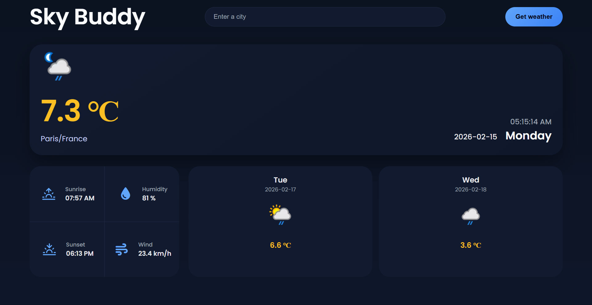

# 🌦️ SkyBuddy

SkyBuddy is a responsive weather dashboard built with **Vanilla HTML, CSS, and JavaScript**. Users can view the current weather and the upcoming week’s forecast for any city. This project was developed as a hands-on learning experience to practically apply RESTful APIs, responsive design principles, and frontend-backend integration.

---

## 📦 Technologies Used

- **HTML** – Semantic structure and fast prototyping  
- **CSS** – Component-based styling and responsive layouts  
- **Vanilla JavaScript** – Dynamic UI updates and event handling  
- **Weather API** – Fetch live weather data  
- **Feather Icons** – Iconography and lightweight UI elements  
- **Font Awesome** – Icons, modals, and select components  

---

## 🧩 SkyBuddy Features

### Functional Features

- **Current Weather Display**  
  Users can enter a city name, and the dashboard fetches data from the **Weather API**. The current temperature (°C), today’s date, weekday, and real-time clock are displayed and updated every second.

- **Forecast Data Display**  
  The API provides 3-day weather forecasts. The dashboard displays the weather for today and the next 2 days in cards, including weekday, date, weather condition icon, and temperature.

- **Additional Weather Metrics**  
  Displays today’s sunrise time, sunset time, humidity (%), and wind speed (km/h).

- **City Persistence**  
  The last selected city is saved in **localStorage**, ensuring that users see the most recent weather data automatically when refreshing the page.

- **Keyboard Shortcuts**  
  Pressing **Enter** after typing a city name triggers the search automatically.

### UI Features

- **Dark Theme Dashboard**  
  SkyBuddy uses a dark theme with a carefully selected weather-themed color palette. The design includes rounded cards, soft shadows, balanced spacing, and modern typography.

- **Responsive Layout**  
  Fully optimized for **desktop, tablet, and mobile devices**.

- **Scrollable Forecast (Mobile Only)**  
  On smaller screens, forecast cards are horizontally scrollable for better usability.

---

## 👩🏽‍🍳 Development Process

The development of SkyBuddy began with **designing the desktop UI layout**. The focus was on establishing a clean visual hierarchy, defining the placement of key components such as the current weather section, forecast cards, and navigation elements, to create an intuitive and modern dashboard.

Once the design concept was finalized, the **desktop layout** was implemented using semantic HTML and CSS. HTML structured the content logically, while CSS handled layout styling, spacing, typography, and component design. The emphasis was on achieving pixel-perfect consistency with the initial design.

Next, JavaScript was introduced to simulate dynamic behavior. Initially, **mock data** was used to implement client-side logic and DOM updates, allowing testing of event handling, data rendering, and UI updates without relying on the external API. The main card displaying today’s weather—temperature, icon, city name, date, and weekday—was implemented first. In this section, the **real-time clock** functionality was added, updating the hours, minutes, and seconds every second to reflect the current time in the selected city. The secondary grid displaying sunrise, sunset, humidity, and wind metrics was implemented next, followed by the weekly forecast section. Throughout this phase, `querySelector` and `querySelectorAll` were used extensively for efficient DOM manipulation.

After confirming the UI logic with mock data, **real-time weather data** was integrated using a third-party Weather API. The frontend was updated to fetch live weather information based on the selected city.

A key security issue was identified: placing the API key in `script.js` exposed it publicly. To address this, a **backend proxy server** was implemented. The API key was moved to environment variables, and the frontend was updated to call the proxy endpoint instead of the external API directly. This ensured API security and aligned the project with real-world production standards.

Once backend integration was complete, **responsive layouts** for tablets and mobile devices were designed. CSS media queries, flexible containers, and scrollable forecast cards were implemented to optimize usability and readability across screen sizes. 

Finally, a refined **dark theme palette** was applied, spacing and typography were polished, and all components were visually balanced. The result is a modern, professional, and cohesive weather dashboard.

The frontend has been **deployed on Vercel**, providing users with a live, responsive, and secure web application accessible from any device.

---

## 📚 What I Learned

- Implementing a **backend proxy server** to securely handle API requests, keeping the API key hidden from the frontend. This ensures safe communication between frontend and external APIs.

---

## 💭 Future Improvements

- Implement **Light/Dark Theme Toggle**  
- Fetch weather data based on the **user’s current location**

---

## 🚦 Running the Project Locally

1. **Clone the frontend repository**  

```bash  
git clone https://github.com/sithulikaluarachchi/skybuddy.git 
```
2. **Open the backend repository https://github.com/sithulikaluarachchi/skybuddy-backend-proxy of this project and follow the instructions to run the backend locally** 

3. **Run the project using a live server extension (e.g., Live Server in VS Code) to enable auto-refresh** 

## Demo 

**Live** :- https://skybuddy-neon.vercel.app 

